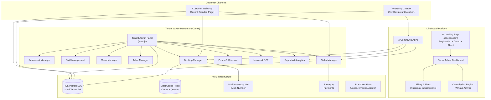
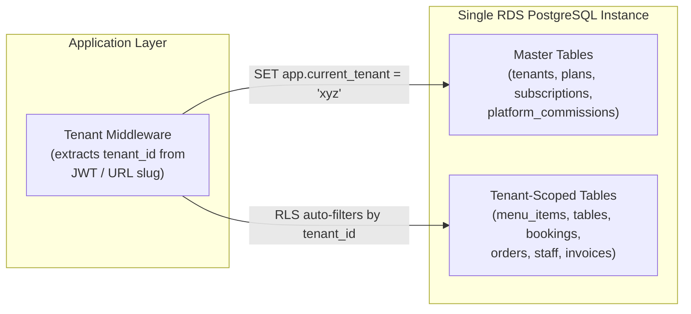
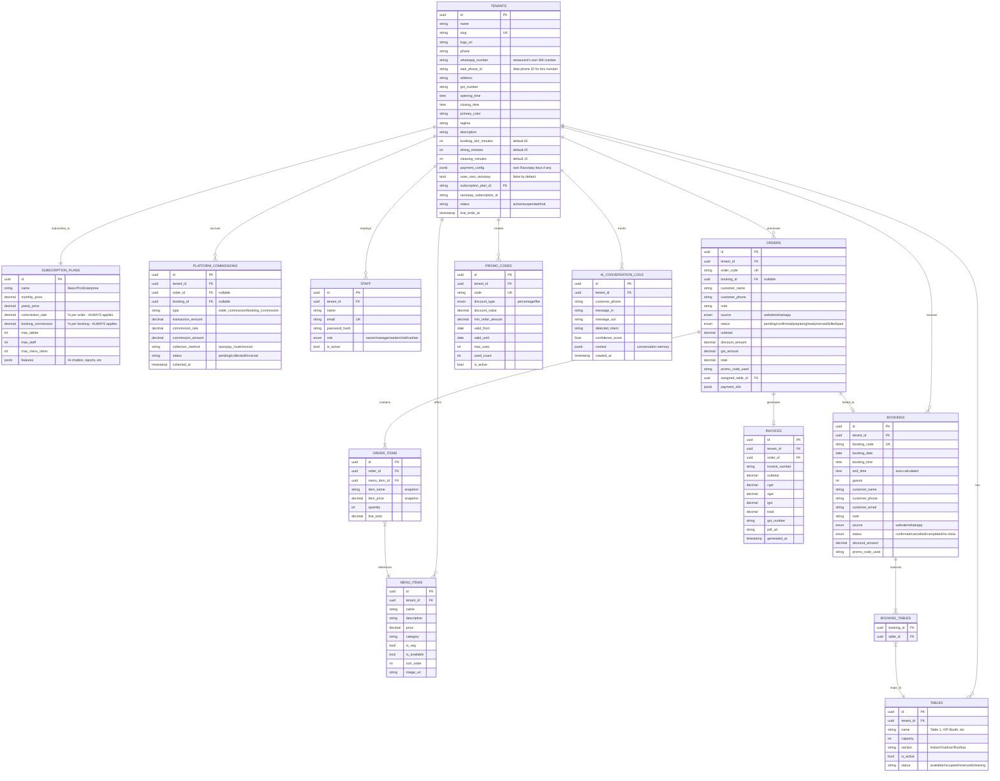
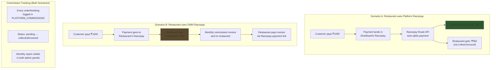
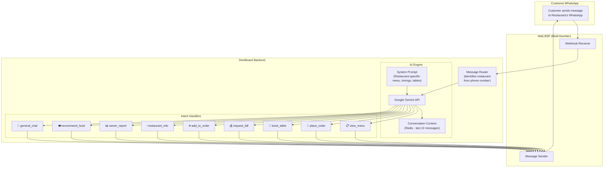
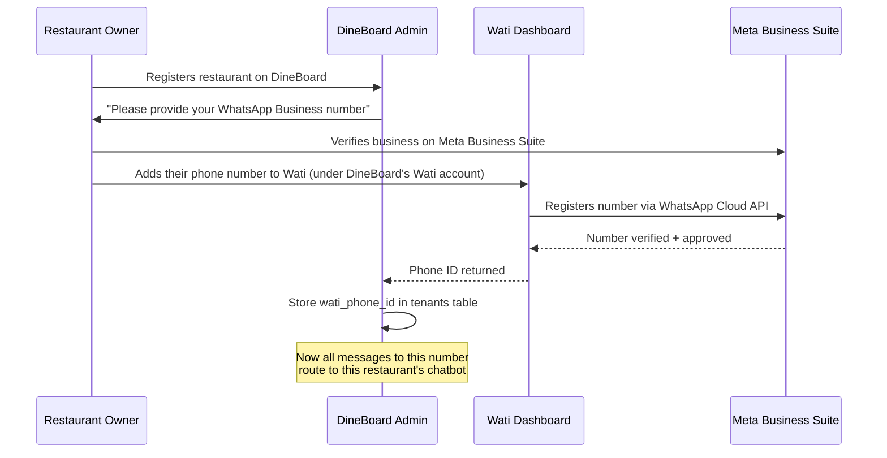
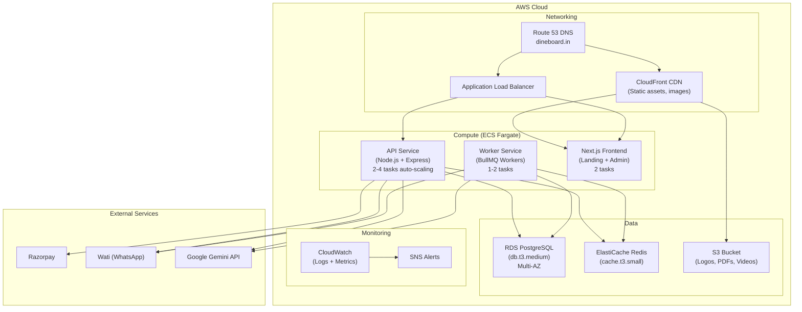
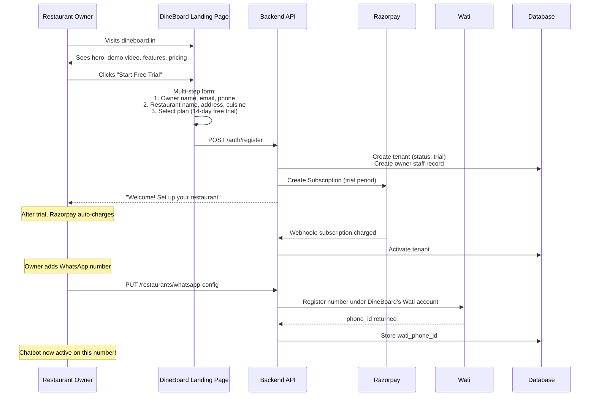
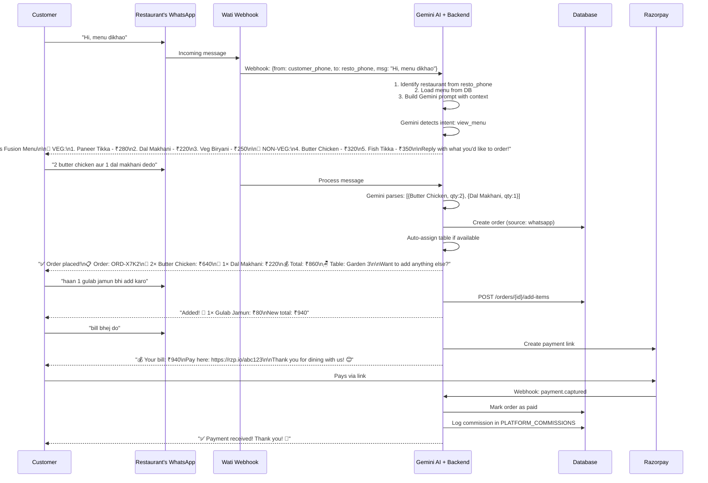
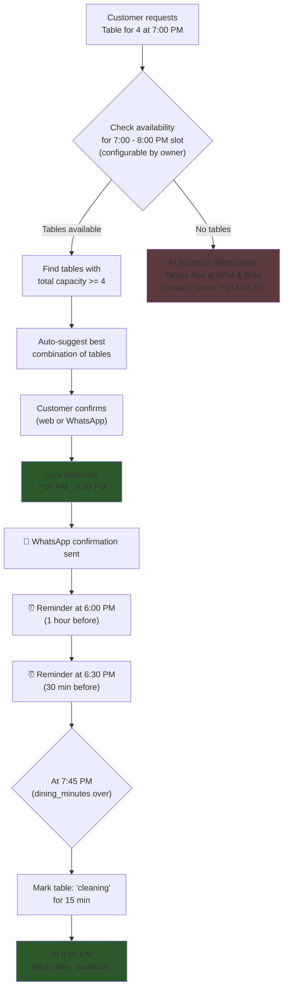

# 🍽️ DineBoard — Multi-Tenant SaaS Restaurant Management System

## System Architecture & Product Design (v2 — Updated)

> **Platform Name: DineBoard** — *Your restaurant, beautifully managed.*

### Decisions Made

| Question | Decision | Rationale |
|---|---|---|
| **Platform Name** | **DineBoard** | Clean, professional, implies a dashboard for dining management |
| **Admin Panel** | **Next.js 14+ (React + TypeScript)** | Rich interactivity, SSR for SEO, component reusability, best DX |
| **ORM** | **Prisma** | Modern, type-safe, auto-generated types, excellent migration system |
| **WhatsApp BSP** | **Wati** | Best flow builder in India, supports multiple numbers per account, good API docs |
| **Deployment** | **AWS** | ECS Fargate + RDS + ElastiCache + S3 + CloudFront |
| **AI Engine** | **Google Gemini API** | Best price/performance for NLU, supports Hindi+English, generous free tier |

---

## Market Research & Competitive Analysis

| Platform | Strengths | DineBoard's Edge |
|---|---|---|
| **Toast** (US) | All-in-one POS, hardware | We're **hardware-free**, WhatsApp-first for India |
| **SevenRooms** | Guest data, reservations | **AI chatbot** + commission-based pricing |
| **OrderIt / SwadPOS** (India) | GST, Zomato/Swiggy | **Full multi-tenancy + AI WhatsApp ordering** |
| **Square** | Easy setup, payments | **Razorpay** (India-native) with Route for splits |
| **Petpooja** (India) | POS + inventory | **AI-powered table booking + slot management** |

### DineBoard's Key Differentiators
1. **AI-Powered WhatsApp Chatbot**: Natural language ordering, booking, bill requests — powered by Gemini AI
2. **Dual Revenue Model**: Subscription + Commission on ALL transactions (even with own Razorpay)
3. **Zero Registration for Customers**: No login/signup needed
4. **Smart Table Management**: Configurable slots (default 45 dining + 15 cleaning)
5. **Per-Restaurant WhatsApp Number**: Each restaurant gets their own branded WhatsApp presence
6. **Platform Landing Page**: Professional company page with registration, demo, about us, policies

---

## High-Level Product Overview



---

## 1. Platform Landing Page (dineboard.in)

> [!NOTE]
> This is the **first page restaurant owners see**. It's a marketing + registration page for your company.

### Pages & Sections

| Page | Content |
|---|---|
| **Home (/)** | Hero section with tagline, demo video (autoplay muted), feature highlights, pricing plans, CTA "Start Free Trial", client testimonials/logos, footer |
| **Features (/features)** | Detailed feature breakdown: ordering, booking, WhatsApp AI, payments, reports |
| **Pricing (/pricing)** | Subscription plans comparison table (Basic/Pro/Enterprise), commission rates, FAQ |
| **About Us (/about)** | Company story, team, mission/vision, contact info |
| **Demo Video (/demo)** | Embedded walkthrough video of the product |
| **Registration (/register)** | Multi-step signup form: Owner details → Restaurant info → Choose plan → Razorpay payment |
| **Login (/login)** | Owner/Staff login to admin panel |
| **Privacy Policy (/privacy)** | GDPR/IT Act compliant privacy policy |
| **Terms & Conditions (/terms)** | Service agreement, usage terms, liability |
| **Refund Policy (/refund)** | Subscription refund policy |
| **Contact (/contact)** | Contact form, email, phone, office address |

### Landing Page Tech
- **Built with**: Next.js (same repo as admin panel, different routes)
- **Animations**: Framer Motion for scroll animations
- **Demo Video**: Hosted on S3 + CloudFront CDN
- **SEO**: Full meta tags, structured data, sitemap.xml

---

## 2. Multi-Tenant Architecture

**Shared Database, Shared Schema** with PostgreSQL **Row-Level Security (RLS)**.



**How it works:**
1. Every API request includes the tenant context (from JWT token for admin, or from URL slug `?r=tinas-fusion` for customer)
2. Backend middleware sets `SET app.current_tenant = '<tenant_id>'` on the database session
3. PostgreSQL RLS policies automatically filter ALL queries to that tenant's data
4. Even if code has a bug, the database **physically prevents** cross-tenant data access

---

## 3. Database Schema



---

## 4. Payment & Commission Architecture (Updated)

> [!IMPORTANT]
> **Commission ALWAYS applies** — whether the restaurant uses the platform's Razorpay or their own. This is the core revenue model alongside subscriptions.

### How Commission Collection Works



**Commission collection methods:**

| Restaurant Payment Setup | Commission Method | How |
|---|---|---|
| Uses **Platform's Razorpay** | **Auto-deducted** via Razorpay Route | Split happens instantly on every payment |
| Uses **Own Razorpay keys** | **Monthly Invoice** | Platform tracks commissions, generates monthly invoice, sends Razorpay payment link |

### Subscription Plans

| Plan | Monthly | Yearly | Commission Rate | Booking Commission | Features |
|---|---|---|---|---|---|
| **Starter** | ₹999 | ₹9,999 | 5% per order | 3% per booking | Menu + Orders + Basic Booking |
| **Pro** | ₹2,499 | ₹24,999 | 3% per order | 2% per booking | + AI Chatbot + Staff Mgmt + Promos |
| **Enterprise** | ₹4,999 | ₹49,999 | 1.5% per order | 1% per booking | + Custom Branding + Priority Support + API Access |

---

## 5. AI-Powered WhatsApp Chatbot Architecture

> [!NOTE]
> The chatbot uses **Google Gemini API** for natural language understanding, making conversations feel human-like rather than rigid menu-driven flows.

### Architecture



### How AI Chatbot Works

**Step 1: Message arrives** → Wati webhook sends to our backend

**Step 2: Identify restaurant** → Match incoming WhatsApp number to `tenants.wati_phone_id`

**Step 3: Build AI context** → Gemini receives:
- **System prompt** with restaurant's menu, timings, tables, policies
- **Conversation history** (last 10 messages from Redis)
- **Current order state** (if customer has an active order)

**Step 4: Gemini responds with structured output:**
```json
{
  "intent": "place_order",
  "confidence": 0.95,
  "entities": {
    "items": [{"name": "Paneer Tikka", "qty": 1}, {"name": "Dal Makhani", "qty": 2}]
  },
  "response_text": "Great choice! I've added 1 Paneer Tikka (₹280) and 2 Dal Makhani (₹440) to your order. Your total is ₹720. Would you like to add anything else, or shall I confirm?",
  "action": "confirm_or_add_more"
}
```

**Step 5: Execute action** → Backend handler processes the intent and sends response

### AI Capabilities

| Capability | Example Customer Message | AI Response |
|---|---|---|
| **Natural Ordering** | "bhai 2 butter naan aur 1 paneer butter masala bhej do" | Understands Hindi, maps to menu items, confirms order |
| **Smart Recommendations** | "kuch accha suggest karo veg me" | Recommends top-rated veg items from the menu |
| **Context-Aware** | "usse hata do" (referring to previous item) | Understands context from conversation history |
| **Restaurant FAQ** | "timing kya hai?" / "parking hai?" | Answers from restaurant's stored details |
| **Booking Help** | "kal 4 logo ke liye table chahiye" | Checks availability, suggests times, books table |
| **Order Modifications** | "1 aur raita add kar do order me" | Adds to existing active order |
| **Bill Request** | "bill bhej do" | Generates bill, sends payment link |
| **Owner Reports** | "aaj ki sale batao" (from owner's number) | Generates and sends report PDF |
| **Multilingual** | Hindi, English, Hinglish — all supported | Gemini handles multilingual naturally |

### Per-Restaurant WhatsApp Number Setup



> [!IMPORTANT]
> **Each restaurant needs their own WhatsApp Business number.** All numbers are managed under DineBoard's single Wati account (multi-number support). This way:
> - Customers message the **restaurant's own number** (feels branded)
> - DineBoard's backend routes messages to the **correct restaurant's chatbot**
> - All managed centrally without restaurant owners needing Wati access

---

## 6. AWS Deployment Architecture



### AWS Cost Estimate (Starting)

| Service | Config | Monthly Cost (est.) |
|---|---|---|
| ECS Fargate (API) | 2 tasks × 0.5 vCPU, 1GB | ~₹3,500 |
| ECS Fargate (Worker) | 1 task × 0.25 vCPU, 0.5GB | ~₹1,200 |
| ECS Fargate (Next.js) | 2 tasks × 0.5 vCPU, 1GB | ~₹3,500 |
| RDS PostgreSQL | db.t3.medium, 50GB | ~₹4,000 |
| ElastiCache Redis | cache.t3.small | ~₹2,000 |
| S3 + CloudFront | 50GB storage | ~₹500 |
| Route 53 | 1 hosted zone | ~₹50 |
| **Total** | | **~₹14,750/mo** |

---

## 7. API Architecture

```
/api
├── /auth
│   ├── POST /register                  # New restaurant owner signup
│   ├── POST /login                     # Staff/Owner login (returns JWT)
│   └── POST /forgot-password           # Password reset
│
├── /platform                            # Landing page data
│   ├── GET  /plans                      # Public: list subscription plans
│   ├── POST /contact                    # Contact form submission
│   └── GET  /demo-video                 # Demo video URL
│
├── /restaurants
│   ├── GET  /by-slug/:slug             # Public: get restaurant info
│   ├── PUT  /settings                  # Owner: update restaurant details
│   ├── PUT  /payment-config            # Owner: set own Razorpay keys
│   └── PUT  /whatsapp-config           # Owner: configure WhatsApp number
│
├── /menu
│   ├── GET  /by-slug/:slug             # Public: get menu items
│   ├── POST /items                     # Owner/Manager: add item
│   ├── PUT  /items/:id                 # Owner/Manager: update item
│   └── DELETE /items/:id               # Owner/Manager: delete item
│
├── /tables
│   ├── GET  /                          # Admin: list all tables
│   ├── POST /                          # Admin: add table
│   ├── PUT  /:id                       # Admin: update table
│   └── PUT  /:id/status                # Admin: manual availability toggle
│
├── /bookings
│   ├── POST /check-availability        # Public: check table availability
│   ├── POST /confirm                   # Public: confirm booking (no login)
│   ├── GET  /                          # Admin: list all bookings
│   ├── PUT  /:id/status                # Admin: update booking status
│   └── GET  /reports                   # Admin: booking reports
│
├── /orders
│   ├── POST /create                    # Public: place order (no login)
│   ├── GET  /                          # Admin: list all orders
│   ├── PUT  /:id                       # Admin: modify order
│   ├── PUT  /:id/status                # Admin: update order status
│   ├── POST /:id/add-items             # Customer: add more items
│   ├── POST /:id/send-bill             # Admin: manually send bill
│   └── POST /:id/request-bill          # Customer: request bill
│
├── /staff
│   ├── GET  /                          # Owner: list staff
│   ├── POST /                          # Owner: add staff with role
│   ├── PUT  /:id                       # Owner: update staff
│   └── DELETE /:id                     # Owner: remove staff
│
├── /promos
│   ├── GET  /                          # Admin: list promo codes
│   ├── POST /                          # Admin: create promo code
│   ├── PUT  /:id                       # Admin: update promo
│   └── POST /validate                  # Public: validate promo code
│
├── /invoices
│   ├── POST /generate/:orderId         # Admin: generate invoice with GST
│   ├── GET  /:id/pdf                   # Public: download invoice PDF
│   └── POST /:orderId/send             # Admin: send invoice to customer
│
├── /reports
│   ├── GET  /dashboard                 # Admin: overview stats
│   ├── GET  /orders                    # Admin: order reports
│   ├── GET  /revenue                   # Admin: revenue reports
│   ├── GET  /bookings                  # Admin: booking reports
│   └── GET  /export/pdf                # Admin: export as PDF
│
├── /payments
│   ├── POST /create-link               # Generate Razorpay payment link
│   ├── POST /webhook                   # Razorpay payment webhook
│   └── GET  /commissions               # Admin: view commission history
│
├── /whatsapp
│   ├── POST /webhook                   # Incoming WhatsApp messages (Wati)
│   ├── POST /send                      # Outgoing messages
│   └── POST /ai/process                # AI message processing
│
├── /ai
│   ├── POST /recommend                 # AI food recommendations
│   └── GET  /conversation/:phone       # Get conversation history
│
└── /superadmin
    ├── GET  /tenants                    # List all restaurants
    ├── GET  /revenue                    # Platform revenue report
    ├── GET  /commissions                # All commission records
    ├── POST /commissions/invoice        # Generate monthly commission invoice
    ├── POST /plans                      # Manage subscription plans
    └── PUT  /tenants/:id/status         # Suspend/activate restaurant
```

---

## 8. End-to-End Flows

### Flow 1: Restaurant Owner Registration (via Landing Page)



### Flow 2: Customer Orders via AI WhatsApp Chatbot



### Flow 3: Table Booking with Smart Slots



---

## 9. Tenant Admin Panel (Next.js)

| Module | Features |
|---|---|
| **Dashboard** | Today's orders, revenue, bookings at a glance, live order feed |
| **Restaurant Setup** | Logo, name, tagline, address, timing, primary color, description, WhatsApp number |
| **Menu Management** | Add/edit/delete items, categories, veg/non-veg, pricing, availability toggle, images |
| **Table Management** | Add tables, set capacity, sections, change seating combinations, manual status toggle |
| **Booking Management** | View bookings, confirm/cancel, calendar view, adjust slot timings (dining + cleaning mins) |
| **Order Management** | Live orders, update status, modify items, apply discounts, send bill, view payment status |
| **Staff Management** | Add staff: owner/manager/waiter/chef/cashier, role-based permissions |
| **Promo Codes** | Create/edit codes, % or flat discount, validity dates, max uses, min order amount |
| **Invoice & GST** | Add GSTIN + CGST/SGST rates, auto-generate invoices, download PDF, send to customer |
| **Reports** | Revenue, orders, bookings, table utilization — filterable, export PDF, WhatsApp delivery |
| **Payment Settings** | Add own Razorpay keys or use platform's, view commission history |
| **AI Chatbot Logs** | View all WhatsApp conversations, AI accuracy, customer interactions |

---

## 10. Background Jobs (BullMQ + Redis)

| Job | Trigger | Action |
|---|---|---|
| `booking-reminder-1hr` | Cron every 5 min | Send WhatsApp reminder 1hr before booking |
| `booking-reminder-30min` | Cron every 5 min | Send WhatsApp reminder 30 min before booking |
| `table-status-cleaning` | After dining_minutes | Change table to "cleaning" |
| `table-status-available` | After cleaning_minutes | Change table back to "available" |
| `generate-invoice-pdf` | On bill request | Generate PDF with GST, upload to S3 |
| `send-payment-link` | On bill request | Create Razorpay link, send via WhatsApp |
| `commission-track` | On payment captured | Log commission in PLATFORM_COMMISSIONS |
| `commission-route-split` | On payment (platform Razorpay) | Razorpay Route auto-split |
| `commission-monthly-invoice` | 1st of every month | Generate commission invoice for own-Razorpay restaurants |
| `subscription-check` | Daily | Check expired/failed subscriptions |
| `report-generation` | On WhatsApp request | Generate PDF report, send via WhatsApp |
| `ai-context-cleanup` | Hourly | Clear stale conversation contexts from Redis |

---

## 11. Folder Structure

```
dineboard/
├── backend/
│   ├── src/
│   │   ├── config/           # DB, Redis, Razorpay, Wati, Gemini config
│   │   ├── middleware/        # Auth, tenant-context, rate-limiting
│   │   ├── routes/            # Express route handlers
│   │   │   ├── auth.js
│   │   │   ├── platform.js    # Landing page APIs
│   │   │   ├── restaurants.js
│   │   │   ├── menu.js
│   │   │   ├── tables.js
│   │   │   ├── bookings.js
│   │   │   ├── orders.js
│   │   │   ├── staff.js
│   │   │   ├── promos.js
│   │   │   ├── invoices.js
│   │   │   ├── reports.js
│   │   │   ├── payments.js
│   │   │   ├── whatsapp.js
│   │   │   ├── ai.js
│   │   │   └── superadmin.js
│   │   ├── services/          # Business logic
│   │   │   ├── booking.service.js
│   │   │   ├── order.service.js
│   │   │   ├── table.service.js
│   │   │   ├── payment.service.js
│   │   │   ├── commission.service.js   # NEW
│   │   │   ├── whatsapp.service.js
│   │   │   ├── ai.service.js           # NEW - Gemini integration
│   │   │   ├── invoice.service.js
│   │   │   └── report.service.js
│   │   ├── jobs/              # BullMQ workers
│   │   │   ├── reminder.worker.js
│   │   │   ├── table-status.worker.js
│   │   │   ├── invoice.worker.js
│   │   │   ├── commission.worker.js    # NEW
│   │   │   └── ai-cleanup.worker.js    # NEW
│   │   ├── ai/                # AI module
│   │   │   ├── gemini.client.js        # Gemini API wrapper
│   │   │   ├── prompts/               # System prompts per intent
│   │   │   │   ├── base-system.txt
│   │   │   │   ├── order-flow.txt
│   │   │   │   └── booking-flow.txt
│   │   │   ├── intent-router.js        # Routes AI output to handlers
│   │   │   └── context-manager.js      # Redis conversation memory
│   │   ├── utils/
│   │   └── app.js
│   ├── prisma/
│   │   └── schema.prisma
│   ├── package.json
│   └── .env
│
├── frontend/
│   ├── customer/              # Tenant-branded customer page
│   │   └── index.html         # (Enhanced from your template)
│   │
│   └── web/                   # Next.js app (Landing + Admin + SuperAdmin)
│       ├── src/
│       │   ├── app/
│       │   │   ├── (landing)/          # Public landing pages
│       │   │   │   ├── page.tsx        # Home
│       │   │   │   ├── features/
│       │   │   │   ├── pricing/
│       │   │   │   ├── about/
│       │   │   │   ├── demo/
│       │   │   │   ├── contact/
│       │   │   │   ├── privacy/
│       │   │   │   ├── terms/
│       │   │   │   ├── refund/
│       │   │   │   ├── register/
│       │   │   │   └── login/
│       │   │   ├── admin/              # Tenant admin panel
│       │   │   │   ├── dashboard/
│       │   │   │   ├── menu/
│       │   │   │   ├── tables/
│       │   │   │   ├── bookings/
│       │   │   │   ├── orders/
│       │   │   │   ├── staff/
│       │   │   │   ├── promos/
│       │   │   │   ├── invoices/
│       │   │   │   ├── reports/
│       │   │   │   ├── settings/
│       │   │   │   └── ai-logs/
│       │   │   └── superadmin/         # Platform admin panel
│       │   │       ├── tenants/
│       │   │       ├── revenue/
│       │   │       ├── commissions/
│       │   │       └── plans/
│       │   ├── components/
│       │   └── lib/
│       └── package.json
│
├── docker-compose.yml
├── Dockerfile.api
├── Dockerfile.worker
├── Dockerfile.web
├── README.md
└── .env.example
```

---

## 12. Implementation Phases

### Phase 1: Foundation (Week 1-2)
- Project setup (monorepo with backend + Next.js frontend)
- PostgreSQL schema with Prisma + RLS policies
- Auth system (JWT, bcrypt)
- Multi-tenant middleware
- Restaurant CRUD APIs
- **Landing page** (Home, About, Pricing, Register, Login, Privacy, Terms)

### Phase 2: Core Features (Week 3-4)
- Menu management (CRUD + categories)
- Table management with slot system
- Booking flow with availability check + suggestions
- Order flow with auto table assignment
- Enhanced customer web page (from your index.html template)

### Phase 3: Payments & Commission (Week 5)
- Razorpay Subscription integration
- Razorpay Route for auto-split (platform Razorpay users)
- Commission tracking for own-Razorpay users
- Monthly commission invoice generation
- Payment link generation for customer bills

### Phase 4: WhatsApp + AI (Week 6-7)
- Wati webhook integration (multi-number)
- Google Gemini AI integration
- Chatbot conversation flows (order, book, bill, info)
- Context management (Redis)
- AI food recommendations
- WhatsApp template messages (confirmation, reminders, bills)

### Phase 5: Admin Panels (Week 8-9)
- Tenant admin dashboard (Next.js)
- All management modules (menu, tables, bookings, orders, staff, promos)
- Invoice & GST module
- Super admin dashboard

### Phase 6: Notifications & Reports (Week 10)
- WhatsApp booking reminders (1hr + 30min)
- Auto table status updates (dining → cleaning → available)
- Report generation + PDF export
- WhatsApp report delivery for owners

### Phase 7: Polish & Deploy (Week 11-12)
- AWS infrastructure setup (ECS, RDS, ElastiCache, S3, CloudFront)
- CI/CD pipeline
- Security hardening
- Performance testing
- Documentation

---

## Verification Plan

### Automated Tests
```bash
npm run test:unit          # Unit tests (slot logic, commission calc, AI parsing)
npm run test:integration   # API endpoint tests
npm run test:e2e           # Full order + booking flows
```

### Manual Verification
- Multi-tenant isolation (Restaurant A can't see Restaurant B's data)
- WhatsApp AI chatbot conversations (Hindi, English, Hinglish)
- Razorpay payment flows in test mode
- Commission tracking for both payment scenarios
- Customer web page on mobile devices
- Landing page on all devices + SEO audit
- Load test table booking during simulated peak hours
